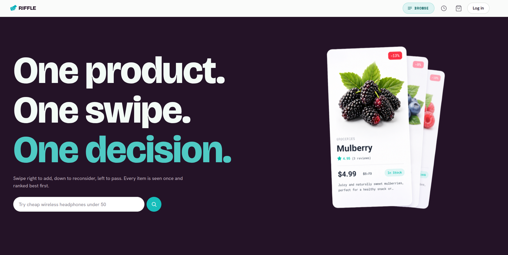
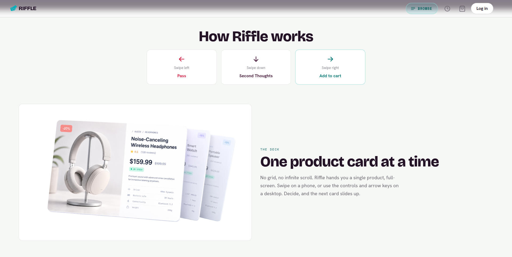
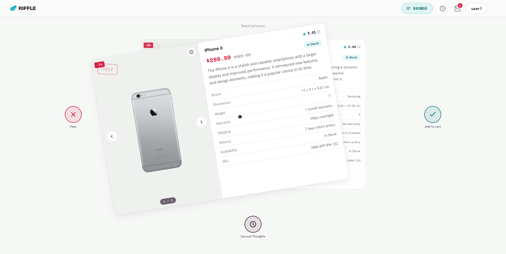
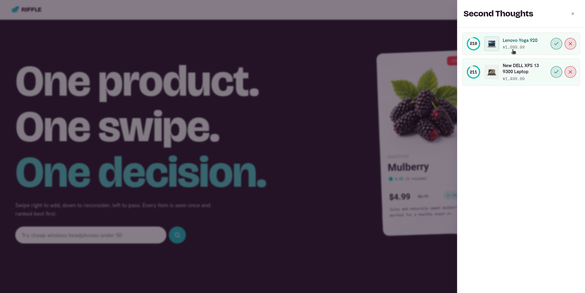
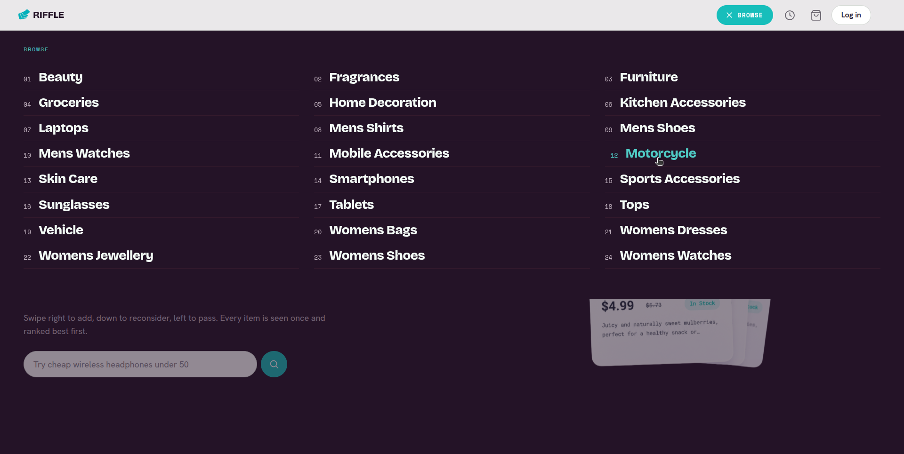
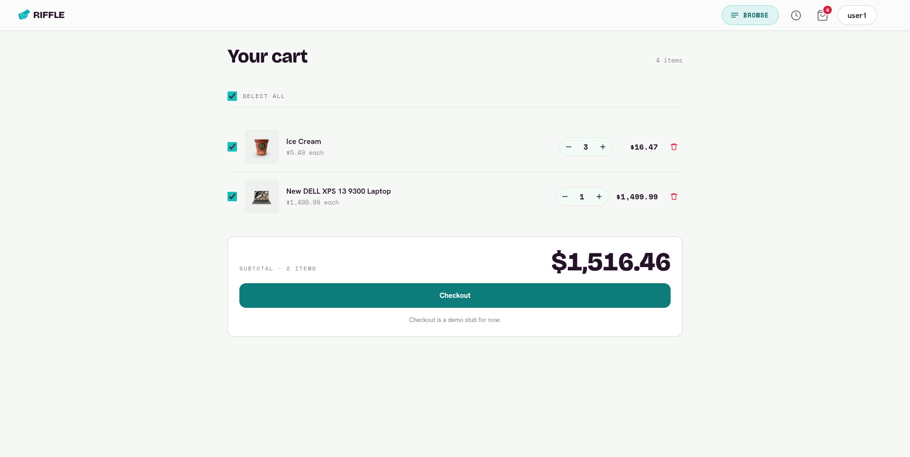
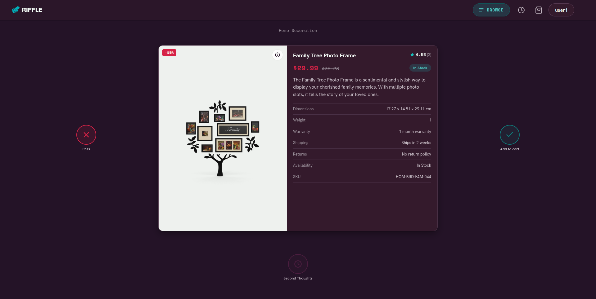

# Riffle

> A swipe-to-decide storefront: see one product at a time and swipe right to cart, down to hold, left to pass.

## About

Riffle reframes online shopping as a deck of cards instead of an endless grid. Inside a deck the shopper
sees a single product at a time and makes one decision: swipe **right** to add it to the cart, **down** to
park it in **Second Thoughts** (a timed holding area), or **left** to pass. Every product is shown **at most
once per user**, the deck is rule-ranked by rating and relevance, and it depletes until empty.

It is a self-contained demo: a Flask backend serves a no-build vanilla-JS frontend on the same origin and
fetches all product data **live from [DummyJSON](https://dummyjson.com)** server-side. The database stores the
**user state only**, never a product catalog.

## Table of contents

- [Preview](#preview)
- [Features](#features)
- [Tech stack](#tech-stack)
- [Project structure](#project-structure)
- [Prerequisites](#prerequisites)
- [Installation and setup](#installation-and-setup)
- [Configuration](#configuration)
- [Running the app](#running-the-app)
- [Usage](#usage)
- [API reference](#api-reference)
- [Design](#design)
- [Contributing](#contributing)
- [License](#license)
- [Acknowledgments](#acknowledgments)

## Preview
###
<p align="center">
  <br>
</p>

<p align="center">
  <br>
</p>

<p align="center">
  <br>
</p>

<p align="center">
  <br>
</p>

<p align="center">
  <br>
</p>

<p align="center">
  <br>
</p>

<p align="center">
  <br>
</p>

## Features

- **One-card-at-a-time deck** with three decisive gestures: right to cart, down to Second Thoughts, left to pass.
- **Works by touch, mouse, and keyboard** (left / down / right arrows) with drag-follow physics and threshold flinging.
- **See-once guarantee** so a product never reappears for the same user once it has been acted on.
- **Second Thoughts holding area** with a server-authoritative countdown: promote to the cart before it expires, or let it go.
- **Rule-ranked deck** scored deterministically by rating, reviews, stock, discount, and query relevance.
- **Free-text search** that is parsed into deck intent (price / quality / deal / category) server-side.
- **Browse by category** from a slide-down panel populated live from DummyJSON.
- **Accounts and a persistent cart** with hashed passwords and signed-cookie sessions.
- **Per-user settings**: deck size, Second-Thoughts duration, ranking preset, currency, light/dark theme, and reduced motion.
- **Reset** that clears the see-once history (keeping the cart) so the deck can be replayed.
- **No build step**: the frontend is plain HTML/CSS/ES modules served directly by Flask.

## Tech stack

| Layer       | Technology                                                         |
|-------------|--------------------------------------------------------------------|
| Backend     | Python 3.12, Flask 3, Flask-SQLAlchemy 3                           |
| HTTP client | `requests` (server-side calls to DummyJSON)                        |
| Database    | SQLite (file at `instance/app.db`, created at runtime)             |
| Frontend    | Vanilla HTML, CSS, JavaScript (ES modules), hash router            |
| Build tools | None (no `package.json` or compile step)                           |
| Fonts       | Bricolage Grotesque, Hanken Grotesk, Space Mono (Google Fonts CDN) |
| Data source | [DummyJSON](https://dummyjson.com) (fetched live, server-side)     |

## Project structure

```
.
├── backend/                 # Flask app (one blueprint per resource)
│   ├── app.py               # App factory + entry point; serves the frontend, registers the API
│   ├── config.py            # All configuration (currency, TTL, ranking weights, presets, defaults)
│   ├── extensions.py        # db = SQLAlchemy()
│   ├── models.py            # User, Decision (see-once ledger), CartItem, SecondThought, ProductCache, UserSettings
│   ├── auth.py              # register / login / logout / me, password hashing, login_required guard
│   ├── dummyjson.py         # DummyJSON client + product_cache read/write
│   ├── query_parser.py      # Free-text query -> deck spec (price / quality / deal / category intent)
│   ├── ranking.py           # Deterministic deck ranking
│   ├── cards.py             # Hydrate a product into a card (original_price + specs)
│   ├── counts.py            # Live cart + Second-Thoughts counters
│   ├── settings.py          # Per-user settings validation + store
│   ├── requirements.txt     # Python dependencies
│   └── api/                 # Route blueprints: categories, parse, deck, swipe, cart,
│                            #   second_thoughts, reset, settings, products
├── frontend/                # Served same-origin by Flask
│   ├── index.html           # Single page shell (header, view container, footer)
│   ├── assets/              # Landing/feature mockup images
│   ├── css/                 # tokens.css (design system) + per-view stylesheets
│   └── js/                  # ES modules: api, router, state, deck, swipe, cart, etc.
├── assets/                  # Holds preview footage
├── instance/                # app.db created here at runtime (gitignored)
└── README.md
```

## Prerequisites

- **Python 3.10 or newer** (developed on 3.12).
- **Internet access** to `https://dummyjson.com` at runtime.
- No frontend toolchain is required.

## Installation and setup

The frontend has no dependencies and no build step, so setup is the backend only. Run everything from the
repo root.

### Backend

```bash
# 1. Clone
git clone https://github.com/ielammari/Riffle.git
cd Riffle

# 2. Create and activate a virtual environment
python3 -m venv .venv
source .venv/bin/activate          # Windows: venv\Scripts\activate

# 3. Install dependencies
pip install -r backend/requirements.txt
```

The SQLite database is created automatically at `instance/app.db` on first run, so no migration or seed step.

### Frontend

No installation needed. The files in `frontend/` are served directly by Flask; just open the app in a
browser once the backend is running (see [Running the app](#running-the-app)).

### JetBrains IDEs

1. **Open the project at the repo root**: `File > Open`, select the `Riffle` folder.
2. **Mark the repo root as Sources Root** so the absolute `backend.*` imports resolve: right-click the
   project root in the Project view, then *Mark Directory as > Sources Root* (Might  not be necessary).
3. **Add the Python interpreter** as a virtualenv: *Settings/Preferences > Project > Python Interpreter >
   Add Interpreter > Add Local Interpreter > Virtualenv*, create (or point at) `.venv` in the repo root.
   - **WebStorm** has no Python support out of the box, install the free **Python Community Edition**
     plugin (*Settings > Plugins > Marketplace*) to get the interpreter and run configurations. If you'd
     rather not, WebStorm is still ideal for the `frontend/` JS/CSS, just run the backend from the built-in
     Terminal using the [Backend](#backend) steps.
4. **Install dependencies** from the Terminal tool window (if the interpreter step didn't):
   `pip install -r backend/requirements.txt`.

## Configuration

Two settings read from the environment. Keep real secrets out of the repo.

| Variable            | Default                   | Description                                                                                         |
|---------------------|---------------------------|-----------------------------------------------------------------------------------------------------|
| `RIFFLE_SECRET_KEY` | `dev-insecure-change-me`  | Flask session signing key. **The current value is for development only.**                           |
| `RIFFLE_ST_TTL`     | `300`                     | Default Second-Thoughts countdown, in seconds. Use a small value (e.g. `12`) to watch items expire. |

Everything else is defined in [`backend/config.py`](backend/config.py), including:

| Setting                                   | Default                                      | Purpose                                          |
|-------------------------------------------|----------------------------------------------|--------------------------------------------------|
| `CURRENCY`                                | `USD`                                        | Display currency symbol                          |
| `DUMMYJSON_BASE` / `REQUEST_TIMEOUT`      | `https://dummyjson.com` / `10`               | Upstream data source and request timeout         |
| `DECK_LIMIT_MIN/DEFAULT/MAX`              | `5` / `30` / `50`                            | Cards returned per deck request                  |
| `DECK_CANDIDATE_LIMIT`                    | `150`                                        | Pool size fetched before ranking                 |
| `RANKING_WEIGHTS`                         | rating-led blend                             | Deterministic ranking weights                    |
| `RANKING_PRESETS`                         | balanced / top_rated / best_deals / low_price | Selectable ranking modes in Settings |

The deterministic ranking score (sorted descending; ties broken by review count, then id):

```
0.55*(rating/5) + 0.15*review_weight + 0.10*(stock>0) + 0.10*discount_weight + 0.10*query_match
```

## Running the app

From the repo root, with the virtual environment active:

```bash
python -m backend.app
```

Then open <http://localhost:5000>.

> Run as a module (`python -m backend.app`) from the repo root: the backend is a package that uses
> absolute `backend.*` imports. The backend serves the frontend, so there is **one** process and **one**
> URL.

> The development server runs with `debug=True` and is meant for local use only; for a real deployment, disable debug and serve the app behind a production WSGI server.

Quick health check:

```bash
curl http://localhost:5000/api/health
```

### JetBrains IDEs (WebStorm, PyCharm, IntelliJ)

Run the backend as a **module from the repo root**:

1. *Run > Edit Configurations > + > Python*.
2. Switch the target from **Script path** to **Module name** and set it to `backend.app`.
3. Set the **Working directory** to the repo root and pick the project virtualenv as the interpreter.
4. **Run**, then open <http://localhost:5000>.

In WebStorm without the **Python plugin**, run it from the Terminal tool window instead: `python -m backend.app`.

## Usage

1. **Open the landing page** at `#/` (public, no login required).
2. **Create an account or log in** at `#/login`. Passwords are hashed; the session is a signed cookie.
3. **Swipe the deck** at `#/deck`:
    - **Right → Cart** adds the product immediately.
    - **Down → Second Thoughts** parks it in the timed tray.
    - **Left → Pass** skips it for good.
    - Use the on-screen buttons (desktop), the arrow keys, or touch/drag (mobile).
4. **Search or browse** to bias the deck by query intent or category.
5. **Manage Second Thoughts** from the clock icon: promote an item to the cart before its countdown ends, or release it.
6. **Review the cart** at `#/cart`, adjust quantities, and remove items.
7. **Tune Settings** at `#/settings`: deck size, hold duration, ranking preset, currency, theme, and motion.
8. **Reset** to clear your see-once history (the cart is kept) and replay the deck.

## API reference

All endpoints return JSON on the same origin. Endpoints marked **auth** require a logged-in session and
return `401` otherwise.

### Auth (prefix `/api/auth`)

| Method | Path        | Description                       |
|--------|-------------|-----------------------------------|
| POST   | `/register` | Create an account                 |
| POST   | `/login`    | Log in, set the session cookie    |
| POST   | `/logout`   | Clear the session                 |
| GET    | `/me`       | Current user, or unauthenticated  |

### Catalog and search (prefix `/api`)

| Method | Path           | Auth | Description                                                  |
|--------|----------------|------|-------------------------------------------------------------|
| GET    | `/categories`  |      | Category list (live from DummyJSON)                         |
| GET    | `/parse?q=`    |      | Parse free text into a deck spec                            |
| GET    | `/deck`        | ✓    | Ranked, see-once deck. Params: `q`, `category`, `limit`     |
| GET    | `/products/<id>` |    | Single hydrated product (debug helper)                      |

### User state (prefix `/api`)

| Method | Path                            | Auth | Description                                      |
|--------|---------------------------------|------|--------------------------------------------------|
| POST   | `/swipe`                        | ✓    | Record a swipe (right / down / left)             |
| GET    | `/cart`                         | ✓    | List cart items                                  |
| PATCH  | `/cart/<product_id>`            | ✓    | Update an item's quantity                        |
| DELETE | `/cart/<product_id>`            | ✓    | Remove an item                                   |
| GET    | `/second-thoughts`              | ✓    | List held items with `server_now` + `expires_at` |
| POST   | `/second-thoughts/<id>/promote` | ✓    | Move a held item to the cart                     |
| DELETE | `/second-thoughts/<id>`         | ✓    | Release a held item                              |
| POST   | `/reset`                        | ✓    | Clear the see-once ledger + tray (keep cart)     |
| GET    | `/settings`                     | ✓    | Read per-user settings                           |
| PUT    | `/settings`                     | ✓    | Update per-user settings                         |

### Health

| Method | Path          | Description           |
|--------|---------------|-----------------------|
| GET    | `/api/health` | Returns `{"ok": true}`|

## Design

Riffle ships an **editorial light theme** by default with a **dark-mode toggle**. The type
system pairs Bricolage Grotesque (display), Hanken Grotesk (body), and Space Mono (labels). Every color,
spacing, radius, shadow, and motion value is a CSS variable in
[`frontend/css/tokens.css`](frontend/css/tokens.css). Product photos sit on a light image tile so they stay
legible, swipe cues use a consistent pass / hold / cart language, and motion relies on `transform`/`opacity`
only while honoring `prefers-reduced-motion`.

## Contributing

Contributions are welcome. Please open an issue to discuss substantial changes first. The house rules for
this codebase: keep the frontend build-free (vanilla HTML/CSS/ES modules), keep all design values in
`tokens.css` (no hardcoded hex in components), and keep product data fetched live from DummyJSON.

## License

Distributed under the MIT License. See [LICENSE](LICENSE) for details.

## Acknowledgments

- Product data from [DummyJSON](https://dummyjson.com).
- Type from [Google Fonts](https://fonts.google.com): Bricolage Grotesque, Hanken Grotesk, Space Mono.
